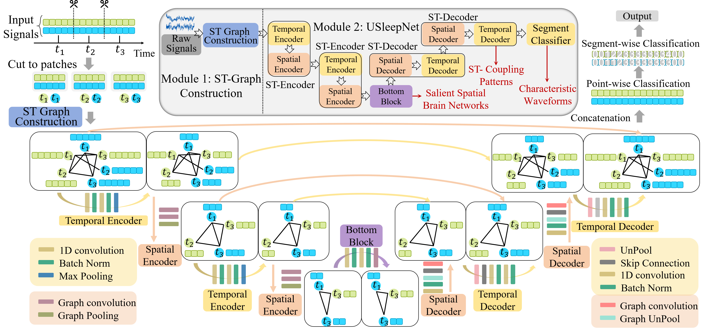
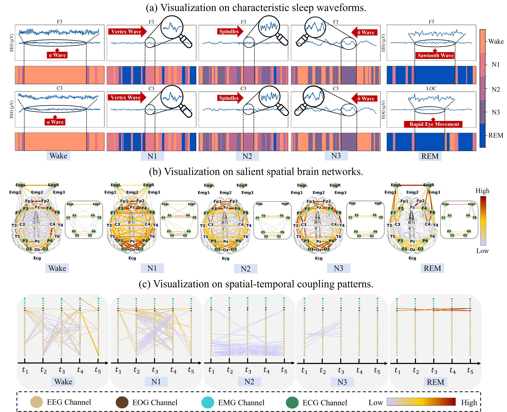

# ST-USleepNet

## Introduction

**ST-USleepNet** is a novel deep learning framework for automated multi-channel sleep staging, designed to extract and model discriminative features from raw EEG signals. It consists of:

- A **Spatial-Temporal Graph Construction module (ST)**, which transforms raw EEG signals into spatial=temporal graphs by leveraging similarity, spatial, and temporal relationships.
- A **U-shaped Sleep Network (USleepNet)**, which extracts characteristic sleep waveforms and salient spatial brain networks by segmenting the signal and graph inputs using dual U-Net architectures.

<p align="center">
  
</p>

## Visualization

Visualization of three types of features learned by ST-USleepNet:

<p align="center">
  
</p>
## Getting Started

This repository provides a PyTorch implementation of the ST-USleepNet backbone. The training pipeline is enhanced with [Weights & Biases (wandb)](https://wandb.ai/) for experiment tracking and visualization.

1. Prepare the dataset
   - Resample signals to 100 Hz
2. Set up directories
   - Create folders to store logs and trained models
3. run the model
   - `python src/main.py`

## Acknowledgements

We gratefully acknowledge the authors of [Graph U-Nets](https://github.com/HongyangGao/Graph-U-Nets) for their open-source implementation, which inspired the graph-based components of our model.

## Reference

If you find this work helpful, please cite:

```bibtex
@article{ma2024st,
  title={ST-USleepNet: A spatial-temporal coupling prominence network for multi-channel sleep staging},
  author={Ma, Jingying and Lin, Qika and Jia, Ziyu and Feng, Mengling},
  journal={arXiv preprint arXiv:2408.11884},
  year={2024}
}
```

